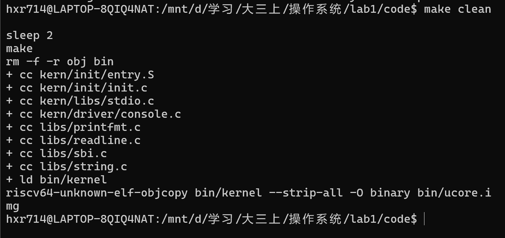
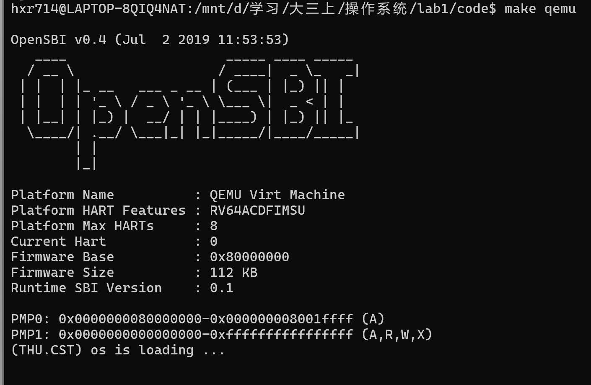
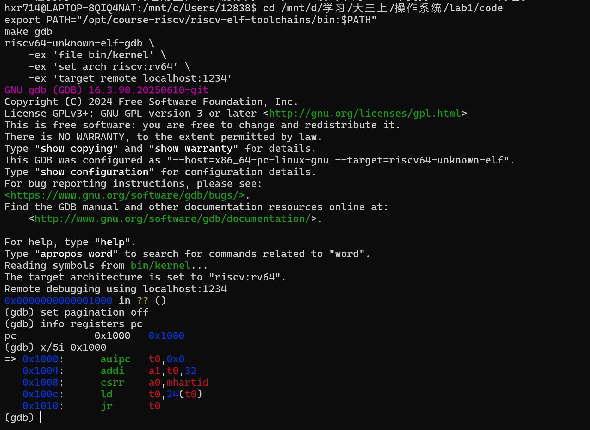
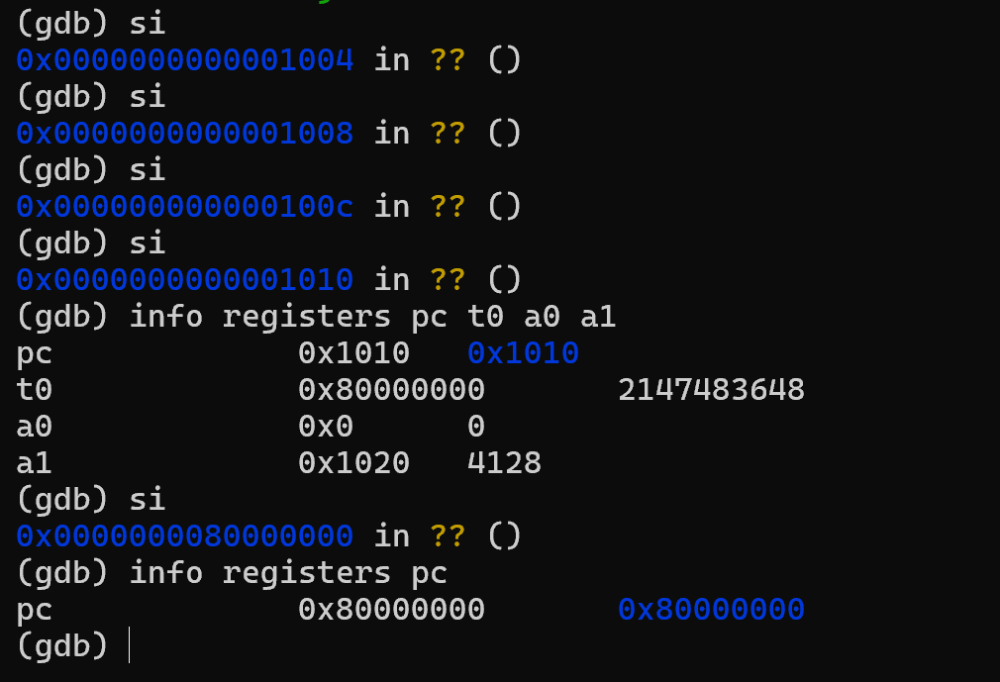
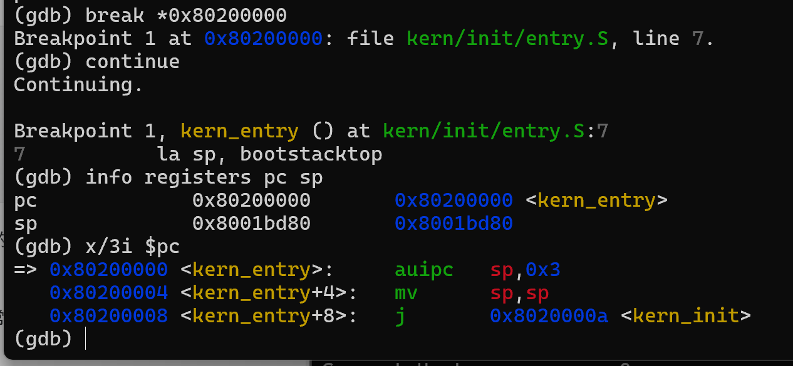
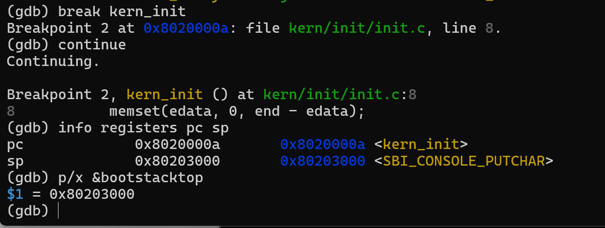

# 操作系统实验报告

## 实验基本信息

| 项目 | 内容 |
|------|------|
| 实验名称 | Lab1：比麻雀更小的麻雀（最小可执行内核），含 Lab0、Lab0.5 前置学习 |
| 小组成员 | 待成员补充学号、姓名 |
| 完成日期 | 2026-10-07 |

### 小组分工

| 成员 | 负责的练习/模块 | 报告分工 |
|------|----------------|----------|
| 待补充 | 按实际分工填写 | 按实际分工填写 |

## 一、实验目的

1. 通过 Lab0 熟悉 Linux、交叉编译、QEMU 和 GDB 的分工，理解宿主架构与目标架构的区别。
2. 通过 Lab0.5 学习以可信上下文、接口清单和行为规格组织提示词，并通过实际构建与调试核验 AI 输出。
3. 理解从复位 ROM、OpenSBI 到内核入口的控制权交接，理解栈、链接地址、未初始化数据清零与 SBI 输出。
4. 使用 GDB 观察复位指令、固件入口、内核入口和栈寄存器，回答 Lab1 两项练习。

## 二、实验环境

### AI 工具

| 成员 | AI 编程工具 | 底层模型 | 备注 |
|------|------------|---------|------|
| 待成员补充 | 待填写实际工具 | 待填写实际模型 | 按实际使用情况填写 |

实验通过 Codex 桌面会话进行。成员实际使用的工具与模型由成员确认后填写。

### 实验环境

| 项目 | 实测值 |
|------|--------|
| 宿主/开发系统 | Windows + WSL2；Ubuntu 24.04.5 LTS，x86_64 |
| Make | GNU Make 4.3 |
| 交叉编译器 | riscv64-unknown-elf-gcc 15.1.0 |
| 调试器 | 工具链 GDB 16.3.90.20250610-git |
| 模拟器 | QEMU 4.1.1，virt 平台 |
| 固件 | QEMU 默认 OpenSBI v0.4 |
| 工具链路径 | `/opt/course-riscv/riscv-elf-toolchains/bin` |


## 三、实验整体逻辑分析

### 3.1 本章节的逻辑主线

本章解决“如何让一个最小内核在 RISC-V 模拟机器上开始运行”。Lab0 建立开发环境；Lab0.5 建立需求规格与验证流程；Lab1 将源码编译、链接为目标镜像，由 QEMU 与固件建立运行环境，再从汇编入口进入 C 代码，最终通过 SBI 输出启动文字。

### 3.2 功能的逐步实现

1. 先准备交叉编译器，生成 RISC-V 机器码；宿主 x86_64 编译器不能替代目标工具链。
2. 用链接脚本确定入口与段布局，生成带符号 ELF `bin/kernel`，再生成裸镜像 `bin/ucore.img`。ELF 用于调试，裸镜像用于启动。
3. QEMU 在启动时布置固件与内核镜像；CPU 从复位 ROM 执行，经 OpenSBI 将控制权交给内核。
4. `kern_entry` 建立内核栈，再进入 `kern_init`，为 C 调用和局部变量提供栈环境。
5. `kern_init` 清零未初始化静态存储区域，通过格式化输出、控制台接口与 SBI 打印启动文字，随后循环等待。

## 四、实验内容与实现

### 前置学习：Lab0 环境准备

**负责人：** 待补充。

使用 WSL 与课程工具链完成实验。Make、QEMU、工具链 GCC/GDB 可用；工具链路径为 `/opt/course-riscv/riscv-elf-toolchains/bin`。

交叉编译解决生成目标架构机器码的问题；QEMU 解决在宿主机运行目标机器的问题；OpenSBI 提供机器态固件服务；GDB 通过 QEMU 远程调试接口观察客体 CPU 和内存。

### 前置学习：Lab0.5 AI 协作与提示词规范

**负责人：** 待补充。

标准提示词包括 `[PROMPT]`、`[RELY]`、`[GUARANTEE]`、`[SPECIFICATION]`。前者明确任务、操作和输出；RELY 提供与代码一致的最小可信上下文；GUARANTEE 列出接口；SPECIFICATION 对各接口说明 Pre-Condition 和 Post-Condition，必要时补充 Case 与 Requirements。规格应描述行为，而非机械抄录实现步骤。

完整任务提示词见 [prompt.md](prompt.md)，按整体任务、环境与构建、入口与初始化、SBI 输出、GDB 验证、报告整理六项组织；每项包括任务目标、可信上下文、接口清单与行为规格。条目编号表示功能划分，不代表调用或迭代次数。

### 功能模块：最小内核启动与调试

**负责人：** 待补充。

#### 模块功能描述

```c
int kern_init(void) __attribute__((noreturn));
void *memset(void *s, char c, size_t n);
int cprintf(const char *fmt, ...);
int vcprintf(const char *fmt, va_list ap);
void cons_putc(int c);
void sbi_console_putchar(unsigned char ch);
uint64_t sbi_call(uint64_t sbi_type, uint64_t arg0,
                  uint64_t arg1, uint64_t arg2);
```

本实验核心逻辑已由初始工程给出，不是代码填空任务。`kern_entry` 是汇编入口，不应编造 C 函数签名。`kern_init` 使用链接符号 `edata`、`end` 清零静态未初始化存储，然后通过 `cprintf → vcprintf → vprintfmt → cputch → cons_putc → sbi_console_putchar → sbi_call` 输出字符。`ecall` 请求固件服务；完成输出后内核无限循环。

链接脚本将入口设为 `0x80200000`，对齐数据段到页边界；栈分配在 `.data`，大小为两页，即 8192 字节，避免被后续 BSS 清零覆盖。当前 ELF 的 LOAD 段没有额外 BSS 字节，清零区间可能为空；这不影响清零代码对后续新增静态变量的意义。

#### 最终提示词

完整四块任务规格见 [prompt.md](prompt.md)。核心要求如下：

```text
[PROMPT] 修改实际工程，验证启动模块，完善 GDB 配置并整理真实报告。
[RELY] ENTRY(kern_entry)，BASE_ADDRESS=0x80200000；PGSIZE=4096；
       KSTACKPAGE=2；保留原有 kern_init、SBI 与输出接口。
[GUARANTEE] 保留 int kern_init(void) __attribute__((noreturn))；
            make gdb 支持 GDB 覆盖；交付 report.md、prompt.md。
[SPECIFICATION] kern_entry 的前置条件为固件交接且栈区域有效；
后置条件为进入 C 前 sp=bootstacktop。kern_init 的前置条件为
栈与固件服务可用；后置条件为清零、输出并持续循环。
调试须实测复位与固件、内核入口，准确记录测试结果。
```

#### 实现迭代过程

本模块的构建与启动调试验证经历了 **2 次迭代**。迭代围绕构建配置、调试脚本和验证规格展开；内核启动逻辑保持不变。以下次数对应实际验证过程，`prompt.md` 的六个条目是功能任务划分，不代表六次迭代。

---

##### 第一次迭代

**任务与提示词要求：**

按启动模块任务规格完成构建、QEMU 启动和 GDB 跟踪，检查复位地址、固件入口、内核入口及启动栈。构建生成 `bin/kernel` 和 `bin/ucore.img`，QEMU 使用 `-kernel` 启动。

**遇到的问题：**

- GDB 脚本在复位处连续执行五次 `si` 后，才打印“跳转前”状态，此时 `pc` 已经是 `0x80000000`，实际已经进入固件。继续执行一次 `si` 后，标记为“固件入口”的观察点变为 `0x80000004`。没有编译错误或运行异常，但观察点与标签不一致，不能准确证明入口交接。
- 原因是将“执行完全部复位指令”与“停在最后一条跳转指令之前”混淆。实测 ROM 有五条指令，第五条 `jr t0` 本身会完成跳转。

**问题解决策略：**

- 将调试规格细化为两个可核验状态：跳转前 `pc=0x1010` 且 `t0=0x80000000`；执行跳转后 `pc=0x80000000`。修正脚本，在四次 `si` 后观察寄存器，再执行一次进入固件。
- 在 `[RELY]` 中明确 QEMU 平台、复位地址和调试接口，在 `[SPECIFICATION]` 中要求地址和指令来自实际反汇编。这些要求体现在 [prompt.md](prompt.md) 的启动验证任务中。

**阶段结果：**

- 编译成功，生成目标 ELF 与裸镜像。
- QEMU 输出 `(THU.CST) os is loading ...`。
- 内核入口与 C 入口断点可以命中，栈指针与栈顶符号一致。
- 复位跳转的观察时序需要修正后重新验证。

---

##### 第二次迭代

**任务与提示词要求：**

按细化后的观察条件重新执行构建、启动和调试，验证完整交接链路，并明确测试结果的适用范围。

**遇到的问题：**

- 执行 `make grade` 时得到 `sh: 0: cannot open tools/grade.sh: No such file`，随后 Make 报告 `Error 2`。原因是工程缺少评分脚本，无法执行评分流程；该结果不能解释为内核功能测试不通过，也不能记作评分通过。

**问题解决策略：**

- 将验证要求区分为编译、QEMU 启动、GDB 流程检查和评分测试，各项独立记录结果。在报告整理规格中明确缺少评分脚本时记录“未完成”，不使用“所有相关测试通过”的笼统结论。
- GDB 调用使用 `$(GDB)`，支持通过 `make GDB=gdb-multiarch gdb` 指定调试器；交互调试与 `tools/startup.gdb` 使用一致的连接端口。

**最终结果：**

经过 **2 次迭代**，本模块最终：

- ✅ 编译通过，ELF 架构为 RISC-V ELF64，入口为 `0x80200000`。
- ✅ QEMU 启动验证通过，输出预期启动文字。
- ✅ GDB 验证复位 PC 为 `0x1000`，跳转前 PC 为 `0x1010`，进入固件后 PC 为 `0x80000000`。
- ✅ 命中内核入口 `0x80200000` 和 C 入口 `0x8020000a`，进入 C 时 `sp=bootstacktop=0x80203000`。
- ✅ 已执行的构建、启动和 GDB 检查符合预期。
- 评分测试未完成：缺少 `tools/grade.sh`。
- 编译、启动及 GDB 验证截图已保存到 `images/`，见第五节。

**关键改进点总结：**

1. 将启动验证的前置、后置条件落实到可观察的 PC 与寄存器状态，避免调试标签与实际执行位置不一致。
2. 通过复位暂停时的内存检查确认 QEMU 已预加载内核，明确镜像加载与固件控制权交接的区别。
3. 使用可配置 GDB 调用和统一连接端口，使调试命令更便于复现。
4. 按测试类型分别记录通过或未完成状态，使报告结论与验证范围一致。

---

### 练习1：理解内核启动中的程序入口操作

**负责人：** 待补充。

`la sp, bootstacktop` 将启动栈顶的地址装入栈指针。RISC-V 栈向低地址增长，`bootstacktop` 指向预留栈空间的上边界。建立内核自己的栈后，C 函数的局部变量、寄存器保存和函数调用才有可靠存储空间。`la` 是伪指令，本次实际展开为 `auipc sp,0x3` 与 `mv sp,sp`。

`tail kern_init` 将执行流转入 C 初始化函数，并不为该跳转设置新的返回地址，是尾调用伪指令。本次展开为 `j 0x8020000a`；`ra` 保持固件遗留值。由于 `kern_init` 标记 noreturn 并无限循环，不需要返回汇编入口。

实测进入 C 时 `pc=0x8020000a`，`sp=0x80203000`；`&bootstacktop=0x80203000`，满足栈初始化要求。

对应截图见第五节的“内核入口”和“栈初始化”。GDB 将栈顶地址标注为 `SBI_CONSOLE_PUTCHAR`，是因为该数据符号也位于栈空间上边界地址；判断栈是否正确以 `sp` 和 `&bootstacktop` 的数值一致为准。

### 练习2：使用 GDB 验证启动流程

**负责人：** 待补充。

终端一运行 `make debug`；终端二运行 `make gdb`。QEMU 的 `-S` 在 CPU 开始执行前暂停，`-s` 提供默认 1234 端口。调试命令见 [startup.gdb](../code/tools/startup.gdb)。

```gdb
info registers pc
x/5i 0x1000
x/4i 0x80200000
si
si
si
si
info registers pc t0 a0 a1
si
info registers pc
break *0x80200000
continue
break kern_init
continue
info registers pc sp ra
p/x &bootstacktop
```

实测最初执行的指令位于 QEMU 的复位 ROM `0x1000`，不是直接位于内核，也不是 OpenSBI 主体：

| 地址 | 指令 | 功能 |
|------|------|------|
| 0x1000 | `auipc t0,0` | 得到复位 ROM 基地址 |
| 0x1004 | `addi a1,t0,32` | 将此版本 ROM 配置数据地址 0x1020 传入 a1 |
| 0x1008 | `csrr a0,mhartid` | 读取 hart 编号，本次为 0 |
| 0x100c | `ld t0,24(t0)` | 从 0x1018 读取固件入口 0x80000000 |
| 0x1010 | `jr t0` | 跳入 OpenSBI |

执行跳转后 `pc=0x80000000`，随后固件初始化机器态环境，最终将控制权交给 S 模式内核。断点 `b *0x80200000` 命中 `kern_entry`，继续到 `kern_init` 后验证栈顶一致。

特别说明：使用本次 `-kernel` 配置时，在复位 CPU 还暂停时，`x/4i 0x80200000` 已能看到内核指令，表明镜像已由 QEMU 预加载。指导书的 `watch *0x80200000` 可用于探究写入，但不能保证观察到“固件加载瞬间”；本次不声称观察到了该写入。固件的控制权交接与宿主加载镜像是两个不同动作。

### 拓展：现代笔记本启动

通常经历复位入口、UEFI 固件初始化、引导加载程序、操作系统内核。与本实验相同的是分阶段初始化与控制权交接；不同的是处理器架构、固件接口、存储加载和安全启动机制。本实验没有实现完整 PC 引导管理。

## 五、测试与验证

| 检查项 | 实际结果 |
|--------|----------|
| 清理后构建 | 成功 |
| ELF 架构和入口 | RISC-V ELF64；0x80200000 |
| make qemu | 输出 `(THU.CST) os is loading ...` |
| 复位与固件 | 0x1000 → 0x80000000 |
| 内核及 C 入口 | 0x80200000 → 0x8020000a |
| 栈 | sp 与 bootstacktop 同为 0x80203000 |
| make grade | 未完成：缺少 tools/grade.sh |


QEMU 在内核打印后进入无限循环，自动验证用 timeout 主动结束，退出码 124 属于预期停止机制，不是启动失败。

### 测试截图

以下截图来自在 WSL 中对 `D:\学习\大三上\操作系统\lab1\code` 的实际操作。

**编译结果：** 清理后完成编译、链接与裸镜像生成，没有编译错误。



**QEMU 启动：** OpenSBI v0.4 启动后，内核输出预期启动文字。



**复位指令：** 初始 PC 为 `0x1000`，反汇编显示五条复位指令，对应练习2的初始执行位置和功能分析。



**固件交接：** 四次单步后 PC 为 `0x1010`，t0 为 `0x80000000`；执行跳转后 PC 为 `0x80000000`。



**内核入口：** 命中 `kern_entry`，PC 为 `0x80200000`，可看到栈初始化和进入 C 函数的指令。



**栈初始化：** 命中 `kern_init`，PC 为 `0x8020000a`，sp 与 bootstacktop 同为 `0x80203000`。



工程缺少 `tools/grade.sh`，未完成评分测试，因此没有评分通过截图。

## 六、实验总结与收获

### 对操作系统的理解

| 实验知识点 | 对应 OS 原理 | 关系与差异 |
|------------|--------------|------------|
| 固件交接与内核入口 | 引导与特权级 | 本实验观察 M 模式固件到 S 模式内核，尚未进入用户程序 |
| 建立启动栈 | 执行上下文、调用约定 | 只有一个静态启动栈，没有线程栈与上下文切换 |
| 链接脚本与 BSS | 内存布局、静态存储初始化 | 固定加载地址，无动态装载与页表管理 |
| SBI ecall | 特权调用、服务边界 | 是内核请求固件服务，不是用户态系统调用 |
| QEMU 与 GDB | 机器状态与调试 | 可观察寄存器与指令，但模拟平台不能代表所有真实硬件 |

尚未对应的重要原理包括用户/内核隔离、页表与地址转换、动态物理内存分配、中断处理、进程线程调度、同步互斥、文件系统、页面置换和设备驱动。

### AI 协作开发的经验

规范提示词应使用真实宏、函数签名和调用前后状态；AI 的解释需要用指令、寄存器和输出交叉核验。启动输出验证最小运行链路，GDB 验证控制权交接及栈初始化，报告中的结论应与实际观察对应。成员个人感悟由成员补充。

参考：[Lab1 练习](http://8.135.34.58/lab2026/_book/lab1/lab1_2_1_exercise.html)、[报告要求](http://8.135.34.58/lab2026/_book/lab1/lab1_5_requirement.html)、[标准提示词结构](http://8.135.34.58/lab2026/_book/lab0.5/3_prompt_structure.html)。
